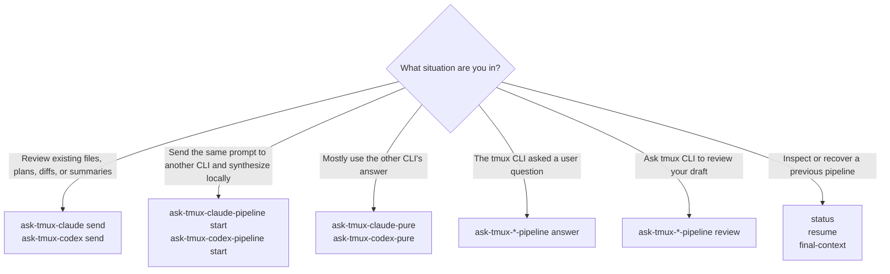
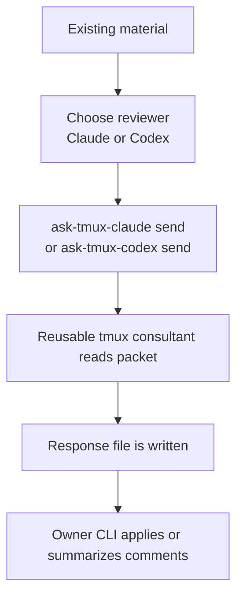
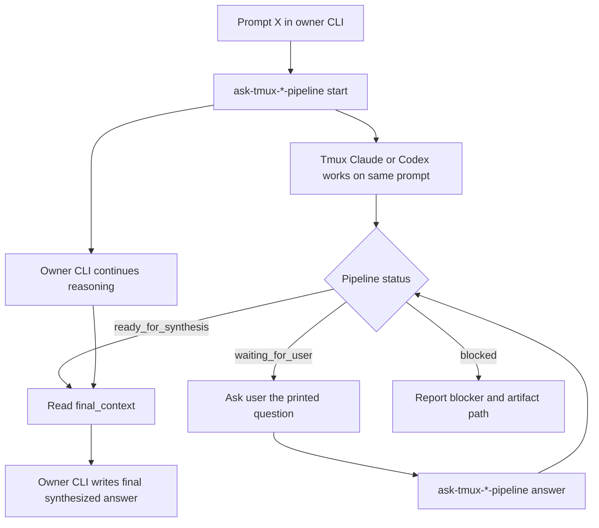
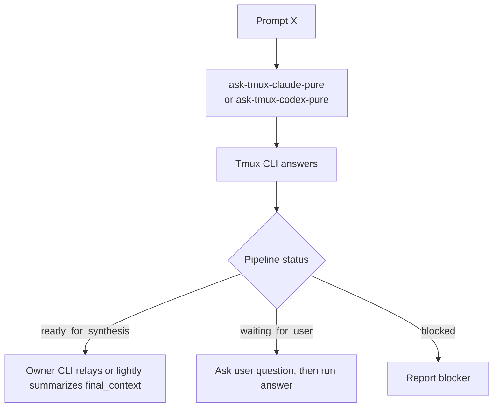
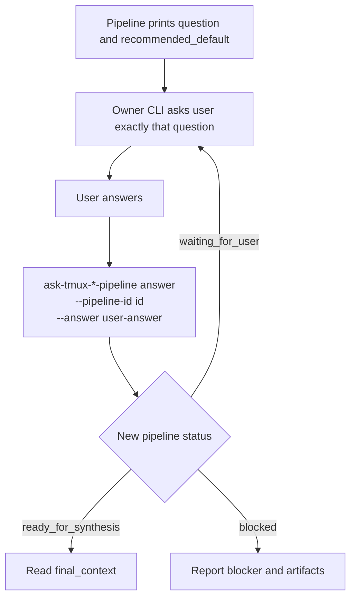
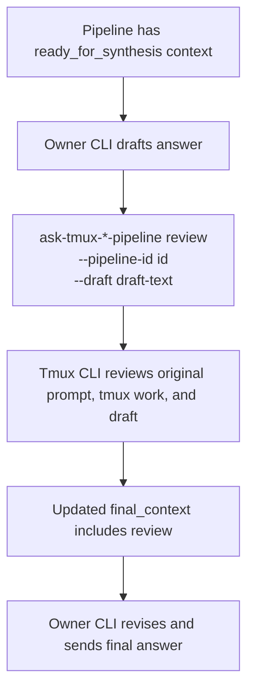
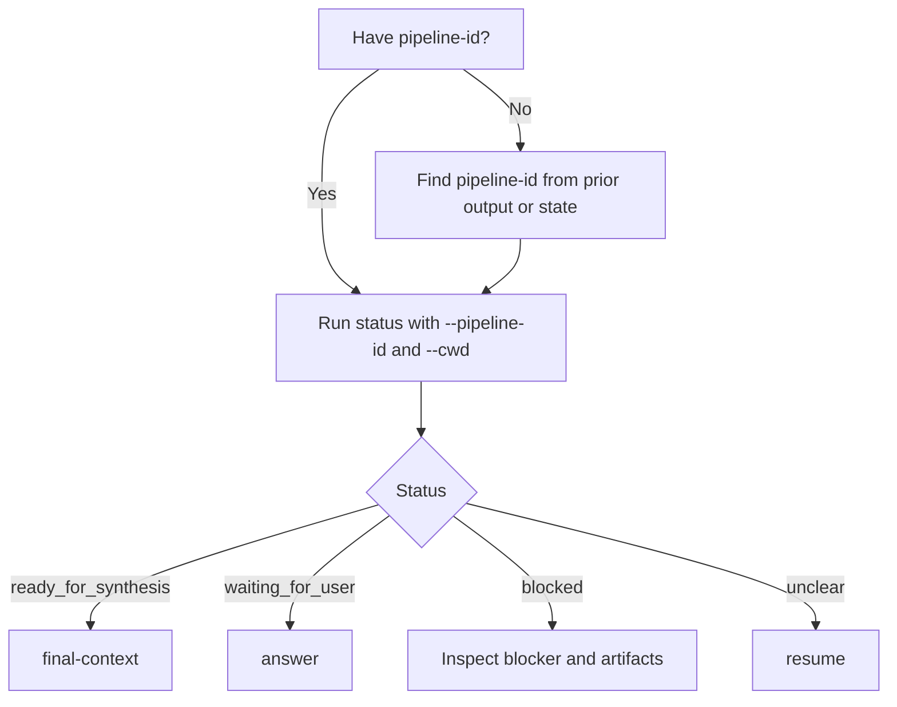

# ask-tmux-pipeline

Stateful tmux-backed Claude/Codex consultant and prompt-pipeline tools for Codex CLI and Claude CLI workflows.

This repo packages two layers:

- Low-level consultant sessions: `ask-tmux-claude`, `ask-tmux-codex`
- Same-prompt pipeline sessions: `ask-tmux-claude-pipeline`, `ask-tmux-codex-pipeline`, plus `*-pure` mirror aliases

The low-level layer is for review/comment/suggest workflows over existing files. The pipeline layer sends the current prompt to a tmux Claude/Codex session, relays clarification questions back to the owner CLI, optionally asks the tmux CLI to review an owner draft, and emits a final context artifact for synthesis.

## Repo Name

Recommended GitHub name: `ask-tmux-pipeline`.

Why: it matches the command family, is provider-neutral, and is short enough to remember.

## Requirements

- Bash
- tmux
- ripgrep (`rg`)
- Python 3
- Claude CLI and/or Codex CLI for live usage

The tools launch Claude/Codex with elevated local permissions, matching the local `ask-tmux` workflow they came from. Only send trusted materials.

## Install

```bash
./install.sh
```

By default this installs:

- scripts to `$HOME/bin`
- Codex skills to `$HOME/.codex/skills`
- Claude skills to `$HOME/.claude/skills`

Override paths if needed:

```bash
BIN_DIR=/usr/local/bin CODEX_SKILLS_DIR=/path/to/codex/skills CLAUDE_SKILLS_DIR=/path/to/claude/skills ./install.sh
```

## Quick Guide

Review existing material with Claude:

```bash
ask-tmux-claude send \
  --key reviewer \
  --cwd /path/to/project \
  --materials /path/to/material.md \
  --prompt "Review, comment, and suggest." \
  --wait
```

Send the same prompt to tmux Claude and synthesize the result in the owner CLI:

```bash
ask-tmux-claude-pipeline start \
  --cwd /path/to/project \
  --prompt "PROMPT X"
```

Pure/mirror mode:

```bash
ask-tmux-claude-pure --cwd /path/to/project --prompt "PROMPT X"
ask-tmux-codex-pure --cwd /path/to/project --prompt "PROMPT X"
```

Continue after a pipeline asks a user question:

```bash
ask-tmux-claude-pipeline answer \
  --pipeline-id <id> \
  --cwd /path/to/project \
  --answer "USER ANSWER"
```

Ask tmux Claude to review the owner CLI draft:

```bash
ask-tmux-claude-pipeline review \
  --pipeline-id <id> \
  --cwd /path/to/project \
  --draft "CURRENT CLI DRAFT"
```

For more examples, see [docs/command-selection-guide.md](docs/command-selection-guide.md).

## Flowcharts

### Overall Command Choice



### Review Existing Material

Use this when the input is already in files or artifacts and you want review/comment/suggest.



### Same Prompt With Owner Synthesis

Use this when the current CLI should remain responsible for the final answer.



### Pure / Mirror Mode

Use this when you mainly want the other CLI's answer.



### Clarification Relay

Use this after a pipeline exits with code `10` and prints `PIPELINE_STATUS=waiting_for_user`.



### Draft Review Before Final Answer

Use this when you have a current CLI draft and want tmux Claude/Codex to critique it before finalizing.



### Recovery And Inspection

Use this when you need to inspect a previous pipeline, recover after an interruption, or fetch the final context again.



## Validation

```bash
tests/smoke.sh
```

The smoke test uses `--stub`, so it does not call live Claude or Codex.

## Safety

- Prefer file-backed packets over pasted giant prompts.
- Keep `--cwd` explicit.
- Use `--pipeline-id` for `answer`, `review`, `status`, `resume`, and `final-context`.
- Treat `~/.omx/state/tmux-pipelines/current.json` as advisory only.
- Do not send secrets, credentials, cookies, or personal login material.

## Friend Links

- [linux.do](https://linux.do) - learn AI @ linux.do

## License

No license has been selected yet.
