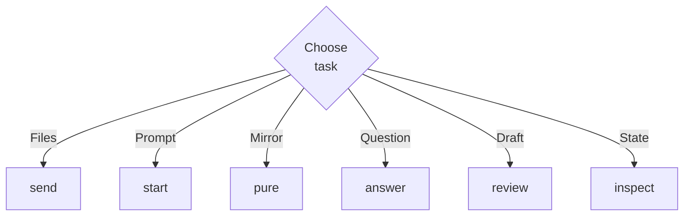
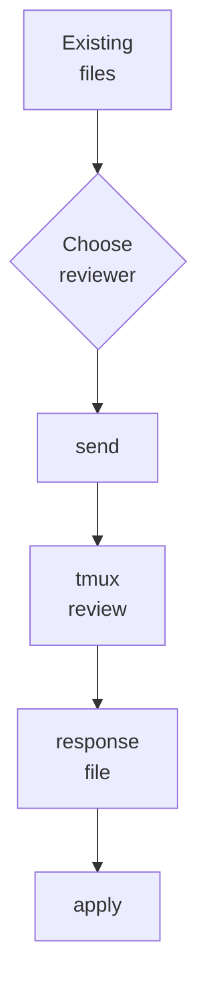
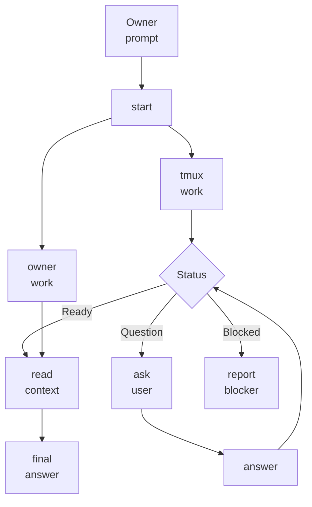
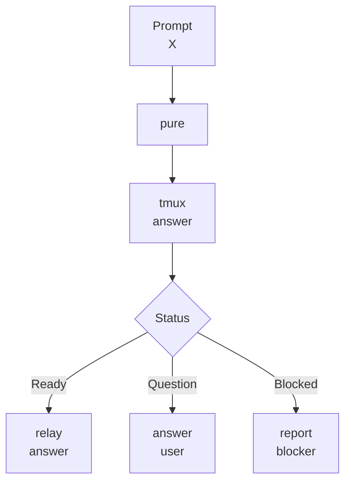
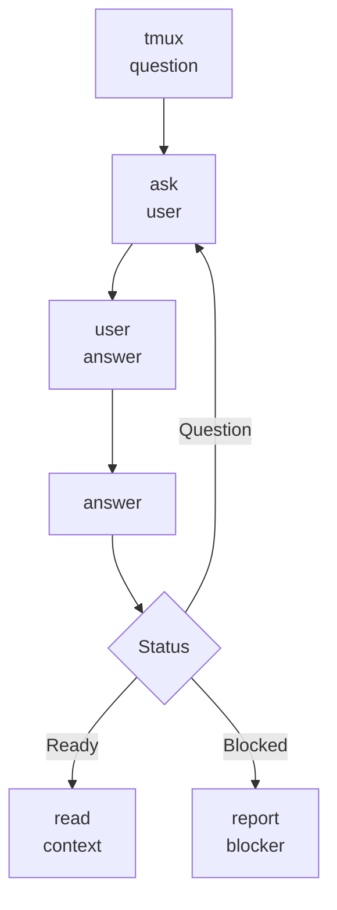
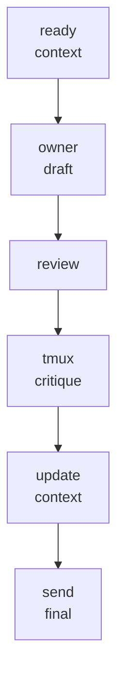
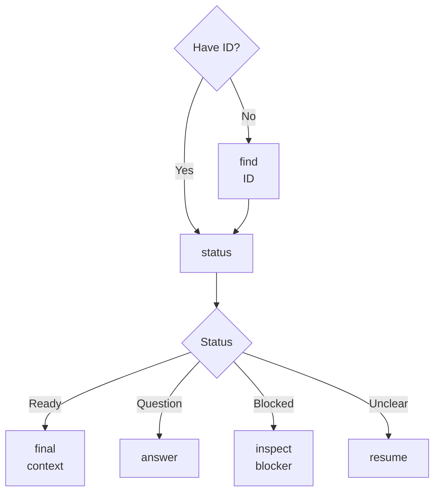

# ask-tmux-pipeline

Stateful tmux-backed Claude/Codex consultant and prompt-pipeline tools for Codex CLI and Claude CLI workflows.

This repo packages two layers:

- Low-level consultant sessions: `ask-tmux-claude`, `ask-tmux-codex`
- Same-prompt pipeline sessions: `ask-tmux-claude-pipeline`, `ask-tmux-codex-pipeline`, plus `*-pure` mirror aliases

The low-level layer is for review/comment/suggest workflows over existing files. The pipeline layer sends the current prompt to a tmux Claude/Codex session, relays clarification questions back to the owner CLI, optionally asks the tmux CLI to review an owner draft, and emits a final context artifact for synthesis.

## Repo Name

Recommended GitHub name: `ask-tmux-pipeline`.

Why: it matches the command family, is provider-neutral, and is short enough to remember.

## Requirements

- Bash
- tmux
- ripgrep (`rg`), or the built-in grep fallback for the runner/test subset
- Python 3
- Claude CLI and/or Codex CLI for live usage

On macOS, install the shell dependencies with Homebrew:

```bash
brew install tmux ripgrep flock coreutils
```

The runner bootstraps Homebrew, GNU coreutils, user-local, and nvm paths when available so non-interactive shells can still find `tmux`, `rg`/grep fallback, `flock`, `realpath -m`, `date -Is`, and provider CLIs.

The tools launch Claude/Codex with elevated local permissions, matching the local `ask-tmux` workflow they came from. Only send trusted materials.

## Reliability Model

The consultant runner checks tmux control access from the actual caller before
creating new request artifacts or launching a provider. It distinguishes socket denial, an
absent server, protocol mismatch, provider readiness failure, provider exit,
definite prompt-delivery failure, accepted-but-unconfirmed prompt delivery,
missing response, completion timeout, and gateway timeout. Pipeline state
retains the typed outcome, retryability, and evidence artifact instead of
collapsing every failure into a generic transport error.

The response protocol prefers a correlated, one-line
`ask_tmux_pipeline.result.v2` JSON envelope. The legacy positional header
format remains accepted during migration, and both formats must identify the
expected pipeline stage.

The runner also handles non-interactive Homebrew paths, Bash 3 environments,
reliable prompt submission, Codex update/workspace-trust prompts, and inherited
state-lock descriptors.

## Install

```bash
./install.sh
```

By default this installs:

- scripts to `$HOME/bin`
- Codex skills to `$HOME/.codex/skills`
- Claude skills to `$HOME/.claude/skills`

The installer stages and validates the complete script-and-skill cohort before
activation. It emits a canonical SHA-256 manifest and one deterministic
`release_id`. Each normalized destination root reserves
`.ask-tmux-pipeline-state/` for a root lock and a canonical `root-owner.json`
bound to the exact three-root installation tuple. The successful owned-set
ledger lives under
`$BIN_DIR/.ask-tmux-pipeline-state/<install-id>/current-manifest.json`.
Changing only `ASK_TMUX_BACKUP_DIR` therefore cannot fork ownership or bypass
mutual exclusion; changing a destination root fails closed and requires an
explicit coordinated migration. A later same-tuple install transactionally
retires only previously owned targets absent from the new cohort; unrelated
paths remain untouched. If a normal activation step fails, it restores every
target already changed. Replaced or retired targets and the prior manifest
remain together in a per-transaction directory under
`$HOME/.local/share/ask-tmux-pipeline/backups/` (or
`ASK_TMUX_BACKUP_DIR`). Review that backup before deleting it.

This rollback is transactional for catchable installer failures; activation
across three destination roots is not atomic against `SIGKILL`, power loss, or
filesystem failure. Cooperative per-root locks prevent concurrent activation
even when two tuples share only one destination root; a stale lock or
conflicting root owner fails closed and requires inspection. The installed
Codex Claude-review skill routes automated sends through
`ask-tmux-claude-gated`; reinstalling this repository must not restore direct
raw-review guidance.

Override paths if needed:

```bash
BIN_DIR=/usr/local/bin CODEX_SKILLS_DIR=/path/to/codex/skills CLAUDE_SKILLS_DIR=/path/to/claude/skills ./install.sh
```

## Quick Guide

Check caller-context tmux access without creating a session or calling a
provider:

```bash
ask-tmux-claude preflight --json
ask-tmux-codex-pipeline doctor
```

Review existing material with Claude:

```bash
ask-tmux-claude-gated send \
  --gate-reason explicit_user_request \
  --key reviewer \
  --cwd /path/to/project \
  --materials /path/to/material.md \
  --prompt "Review, comment, and suggest." \
  --wait
```

For an explicitly requested dual-provider review, use separate concurrent
`cc-claude` and `cc-deepseek` lanes with labelled results:

```bash
ask-tmux-claude-dual send \
  --gate-reason explicit_user_request \
  --key reviewer \
  --cwd /path/to/project \
  --materials /path/to/material.md \
  --prompt "Review, comment, and suggest." \
  --wait
```

`cc-claude` should pin the Anthropic main-session model process-locally
(`claude-opus-5` on the aligned Mac and HPC installations). `cc-deepseek` independently
pins its DeepSeek main and subagent models. The ask-tmux commands select one
launcher per lane and must not set a shared `ANTHROPIC_MODEL`; this preserves
concurrent Claude and DeepSeek sessions. A one-off Claude-provider override can
be supplied with `--model claude-opus-5` (or directly to the launcher with
`CC_CLAUDE_MODEL=<provider-model-id>`). `--model` is rejected for
`cc-deepseek`. Claude uses `high` effort by default; DeepSeek retains its
provider-owned `max` effort. Pipelines persist the selected launcher, model,
and effort across `answer` and `review` continuations.

The runner treats Claude `API Error: 524`
as a terminal provider failure instead of leaving the request busy until the
local wait timeout. Raising `--wait-timeout` cannot extend a gateway's
120-second origin-response limit. It records
`provider_gateway_timeout_524` and does not automatically lower effort,
switch providers, or retry the unchanged workload. Split the task or shorten
the requested output; use a lower one-off `--effort` only when explicitly
chosen.

Send the same prompt to tmux Claude and synthesize the result in the owner CLI:

```bash
ask-tmux-claude-pipeline start \
  --cwd /path/to/project \
  --prompt "PROMPT X"
```

Pure/mirror mode:

```bash
ask-tmux-claude-pure --cwd /path/to/project --prompt "PROMPT X"
ask-tmux-codex-pure --cwd /path/to/project --prompt "PROMPT X"
```

Continue after a pipeline asks a user question:

```bash
ask-tmux-claude-pipeline answer \
  --pipeline-id <id> \
  --cwd /path/to/project \
  --answer "USER ANSWER"
```

Ask tmux Claude to review the owner CLI draft:

```bash
ask-tmux-claude-pipeline review \
  --pipeline-id <id> \
  --cwd /path/to/project \
  --draft "CURRENT CLI DRAFT"
```

For strict provider, effort, and continuation rules, see
[docs/invocation-grammar.md](docs/invocation-grammar.md). For task-oriented
examples, see [docs/command-selection-guide.md](docs/command-selection-guide.md).

## Flowcharts

The diagrams use compact labels and explicit Mermaid Markdown line wrapping to render cleanly on GitHub. Exact command forms are shown in the quick guide above and the command-selection guide.

### Overall Command Choice


```mermaid
flowchart TD
    accTitle: Overall Command Choice
    accDescr: Command selection flow showing whether to review existing material, mirror a prompt, answer a clarification, review a draft, or recover pipeline state

    choose_task{"`Choose
    task`"}
    choose_task -->|Files| send_command["`send`"]
    choose_task -->|Prompt| start_command["`start`"]
    choose_task -->|Mirror| pure_alias["`pure`"]
    choose_task -->|Question| answer_command["`answer`"]
    choose_task -->|Draft| review_command["`review`"]
    choose_task -->|State| inspect_command["`inspect`"]
```

### Review Existing Material

Use this when the input is already in files or artifacts and you want review/comment/suggest.


```mermaid
flowchart TD
    accTitle: Review Existing Material
    accDescr: Review flow for sending existing files or artifacts to a reusable tmux Claude or Codex consultant session

    existing_material["`Existing
    files`"] --> choose_reviewer{"`Choose
    reviewer`"}
    choose_reviewer --> send_packet["`send`"]
    send_packet --> tmux_review["`tmux
    review`"]
    tmux_review --> response_file["`response
    file`"]
    response_file --> owner_apply["`apply`"]
```

### Same Prompt With Owner Synthesis

Use this when the current CLI should remain responsible for the final answer.


```mermaid
flowchart TD
    accTitle: Same Prompt Synthesis
    accDescr: Same-prompt flow where the owner CLI and a tmux CLI work in parallel, then the owner synthesizes the final answer

    owner_prompt["`Owner
    prompt`"] --> start_pipeline["`start`"]
    start_pipeline --> tmux_work["`tmux
    work`"]
    start_pipeline --> owner_work["`owner
    work`"]
    tmux_work --> status_check{Status}
    status_check -->|Ready| read_context["`read
    context`"]
    status_check -->|Question| ask_user["`ask
    user`"]
    status_check -->|Blocked| report_blocker["`report
    blocker`"]
    ask_user --> send_answer["`answer`"]
    send_answer --> status_check
    owner_work --> read_context
    read_context --> final_answer["`final
    answer`"]
```

### Pure / Mirror Mode

Use this when you mainly want the other CLI's answer.


```mermaid
flowchart TD
    accTitle: Pure Mirror Mode
    accDescr: Pure mode flow where the owner CLI mainly relays the tmux Claude or Codex answer, with clarification and blocker paths

    prompt_x["`Prompt
    X`"] --> pure_command["`pure`"]
    pure_command --> tmux_answer["`tmux
    answer`"]
    tmux_answer --> status_check{Status}
    status_check -->|Ready| relay_answer["`relay
    answer`"]
    status_check -->|Question| answer_user["`answer
    user`"]
    status_check -->|Blocked| report_blocker["`report
    blocker`"]
```

### Clarification Relay

Use this after a pipeline exits with code `10` and prints `PIPELINE_STATUS=waiting_for_user`.


```mermaid
flowchart TD
    accTitle: Clarification Relay
    accDescr: Clarification flow for relaying a tmux CLI question to the user and sending the answer back into the same pipeline

    tmux_question["`tmux
    question`"] --> ask_owner["`ask
    user`"]
    ask_owner --> user_answer["`user
    answer`"]
    user_answer --> run_answer["`answer`"]
    run_answer --> next_status{Status}
    next_status -->|Ready| read_context["`read
    context`"]
    next_status -->|Question| ask_owner
    next_status -->|Blocked| report_blocker["`report
    blocker`"]
```

### Draft Review Before Final Answer

Use this when you have a current CLI draft and want tmux Claude/Codex to critique it before finalizing.


```mermaid
flowchart TD
    accTitle: Draft Review Flow
    accDescr: Draft review flow where the owner CLI asks tmux Claude or Codex to critique a draft before the final answer is sent

    ready_context["`ready
    context`"] --> owner_draft["`owner
    draft`"]
    owner_draft --> run_review["`review`"]
    run_review --> tmux_critique["`tmux
    critique`"]
    tmux_critique --> update_context["`update
    context`"]
    update_context --> send_final["`send
    final`"]
```

### Recovery And Inspection

Use this when you need to inspect a previous pipeline, recover after an interruption, or fetch the final context again.


```mermaid
flowchart TD
    accTitle: Recovery Inspection Flow
    accDescr: Recovery flow for locating a pipeline ID, checking status, and choosing whether to fetch context, answer a question, inspect a blocker, or resume

    have_id{Have ID?}
    have_id -->|Yes| run_status["`status`"]
    have_id -->|No| find_id["`find
    ID`"]
    find_id --> run_status
    run_status --> status_check{Status}
    status_check -->|Ready| final_context["`final
    context`"]
    status_check -->|Question| run_answer["`answer`"]
    status_check -->|Blocked| inspect_blocker["`inspect
    blocker`"]
    status_check -->|Unclear| run_resume["`resume`"]
```

## Validation

```bash
bash tests/pipeline-unit.sh
bash tests/preflight-unit.sh
bash tests/consultant-unit.sh
bash tests/provider-wrapper-unit.sh
bash tests/install-unit.sh
bash tests/smoke.sh
```

The tests do not call live Claude or Codex. The smoke test uses isolated tmux
stub sessions and therefore requires the caller to have access to its tmux
socket.

## Safety

- Claude pipeline stages always pass through `ask-tmux-claude-gated` with the
  automatic reason `external_review_required`; a missing gate is a hard error.
  Do not replace it with the raw `ask-tmux-claude` transport.
- A successful initial stage consumes one automatic-review budget slot. Answers
  and draft reviews are audited continuations of that exact pipeline, not new
  starts: they must match its project, consultant key, pipeline fingerprint,
  root digest, ordered stage digest, and fixed 24-hour grant. At most eight
  continuations are allowed. Unrelated pipelines still obey the daily caps and
  20-minute project cooldown.
- A gate denial exits `76`, reports `outcome_kind=policy_deferred`, and records
  `provider_started=false`. An initial denial has
  `PIPELINE_STATUS=policy_deferred`; a denied continuation retains its
  resumable pipeline status. This is an admission-policy outcome, not a tmux or
  provider transport failure.
- Exit `30` remains the migration-compatible umbrella for tmux/provider
  failures. Read `outcome_kind` and, when present, `outcome_artifact` before
  deciding whether to retry.
- Prefer file-backed packets over pasted giant prompts.
- Keep `--cwd` explicit.
- Use `--pipeline-id` for `answer`, `review`, `status`, `resume`, and `final-context`.
- Treat `~/.omx/state/tmux-pipelines/current.json` as advisory only.
- Do not send secrets, credentials, cookies, or personal login material.

## Friend Links

- [linux.do](https://linux.do) - learn AI @ linux.do

## License

MIT License. See [LICENSE](LICENSE).
